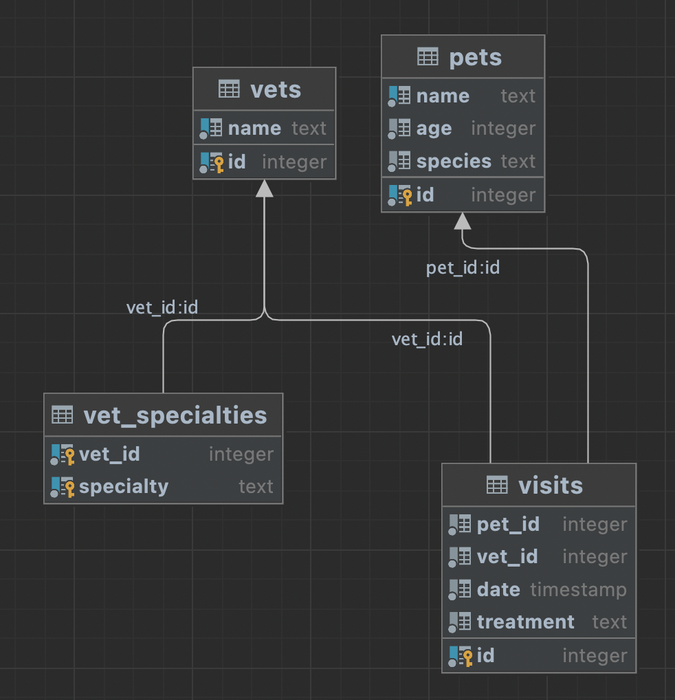

# Pet Clinic with Dropwizard with Newrelic Agent

## Getting the app running with docker

```
git clone https://github.com/TeamCodeStream/petclinic-dropwizard-clm.git
cd petclinic-dropwizard-clm
NEW_RELIC_LICENSE_KEY=12345 docker-compose up -d --build
```

Substitute 12345 with your New Relic license key.

The docker app will generate some traffic that should be visible in NR1 under "Kotlin Dropwizard PetClinic CLM"

Requires Java 18 (Java 19 not compatible with NewRelic agent)

## CLM

Classes with clm methods

- io.baris.petclinic.dropwizard.vet.VetResource
- io.baris.petclinic.dropwizard.pet.PetResource
- io.baris.petclinic.dropwizard.visit.VisitResource
- io.baris.petclinic.dropwizard.petfact.PetFactResource - contains 2 separate Resources in one file 
  and a top level function
- src/main/kotlin/io/baris/petclinic/dropwizard/petfact/client/RandomExt.kt - contains extension functions

Also uses OkHttp client and jdbi for SQL for future CLM integration possibilities.

## About 

This is an example **Kotlin** RESTful web service for a **pet clinic**. 
It is mainly based on [Dropwizard](https://www.dropwizard.io) 
and [PostgreSQL](https://www.postgresql.org).  

The whole list of tools used is as follows:
* [Jakarta RESTful Web Services](https://en.wikipedia.org/wiki/Jakarta_RESTful_Web_Services)
* [Dropwizard](https://www.dropwizard.io)
* [Docker](https://www.docker.com)
* [PostgreSQL](https://www.postgresql.org)
* [Jdbi](https://jdbi.org)
* [Lombok](https://projectlombok.org)
* [Swagger](https://swagger.io)
* [Maven](https://maven.apache.org)

## Installation

### Build project

Run `mvn package` to build project with _Maven_.


### Start application

Run `docker-compose --profile local up` to start application with _Docker_.

To check that your application is running enter url `http://localhost:8080/`

You may see application's health at `http://localhost:8081/healthcheck`

## Database Design



## Endpoints

`GET /pets` Get all pets

`PUT /pets` Create pet

`GET /pets/{pet_id}` Get pet

`POST /pets/{pet_id}` Update pet

`GET /vets` Get all vets

`PUT /vets` Create vet

`GET /vets/{vet_id}` Get vet

`POST /vets/{vet_id}` Update vet

`PUT /visits/pets/{pet_id}/vets/{vet_id}` Make visit to the vet

`GET /visits/pets/{pet_id}` Get visits of the pet
